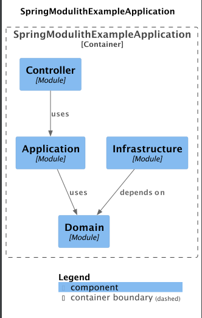
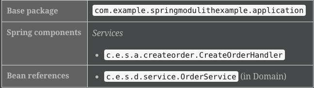
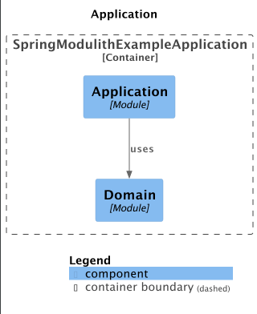

# Getting Started

### Reference Documentation

For further reference, please consider the following sections:

* [Official Gradle documentation](https://docs.gradle.org)
* [Spring Boot Gradle Plugin Reference Guide](https://docs.spring.io/spring-boot/docs/3.1.1/gradle-plugin/reference/html/)
* [Create an OCI image](https://docs.spring.io/spring-boot/docs/3.1.1/gradle-plugin/reference/html/#build-image)
* [Spring Modulith](https://docs.spring.io/spring-modulith/docs/current/reference/html/)

### [Modulith output](modules)

